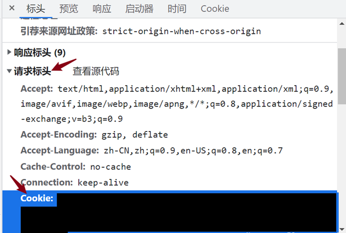

**重要：目前制作时的账号疑似被封禁，请谨慎使用**

# 下载jyeoo网的试卷到*html文件*中

如需打印，请使用浏览器打印或转pdf
# 用法
打开菁优网任意界面，按F12网络抓包，刷新，点列表第一项，右侧找到请求表头中的Cookie一项，右键复制备用。

运行main.py，输入复制的内容，根据提示输入网址即可。
# requements
requests,bs4
运行
pip install -r requriments.txt
安装。