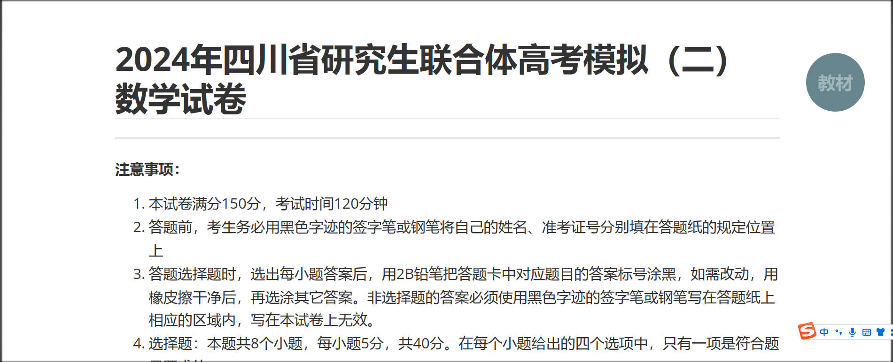
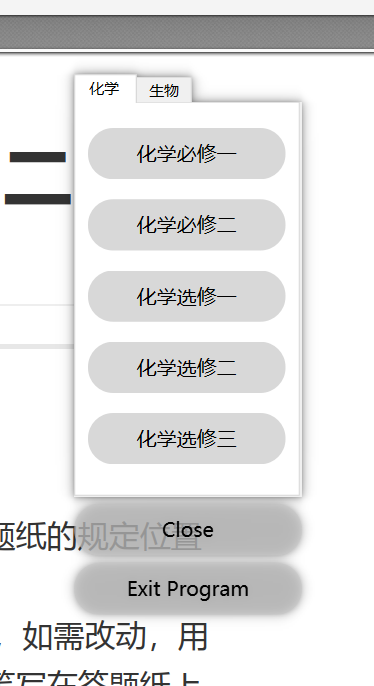

# 快速打开电子教材

## 简介

用于在课堂上快速打开电子教材，支持多科目和多教材。


## 文件结构
- `main.py`：主程序文件，包含所有的界面和功能实现。
- `config.json`：配置文件，存储科目及其对应的教材文件路径。

## 依赖项
- Python 3.x
- PySide6

## 安装
1. 安装 Python 3.x。
2. 安装 PySide6：
    ```bash
    pip install PySide6
    ```
3. 克隆或下载此项目。

## 使用
1. 确保 `config.json` 配置文件存在，并且格式如下：
    ```json
    {
        "科目1": {
            "教材1": "路径/到/文件1",
            "教材2": "路径/到/文件2"
        },
        "科目2": {
            "教材1": "路径/到/文件1",
            "教材2": "路径/到/文件2"
        }
    }
    ```
2. 运行主程序：
    ```bash
    python main.py
    ```
3. 点击圆形按钮打开主界面，选择科目并点击相应按钮打开文件。

## 配置文件
`config.json` 是一个 JSON 格式的配置文件，用于存储科目及其对应的教材文件路径。示例如下：
```json
{
    "数学": {
        "代数": "C:/教材/数学/代数.pdf",
        "几何": "C:/教材/数学/几何.pdf"
    },
    "物理": {
        "力学": "C:/教材/物理/力学.pdf",
        "电学": "C:/教材/物理/电学.pdf"
    }
}
```

## 注意事项

- 确保配置文件中的路径是有效的文件路径。
- 运行程序时需要保证 `config.json` 文件位于与 `main.py` 相同的目录下。

## 示例截图


